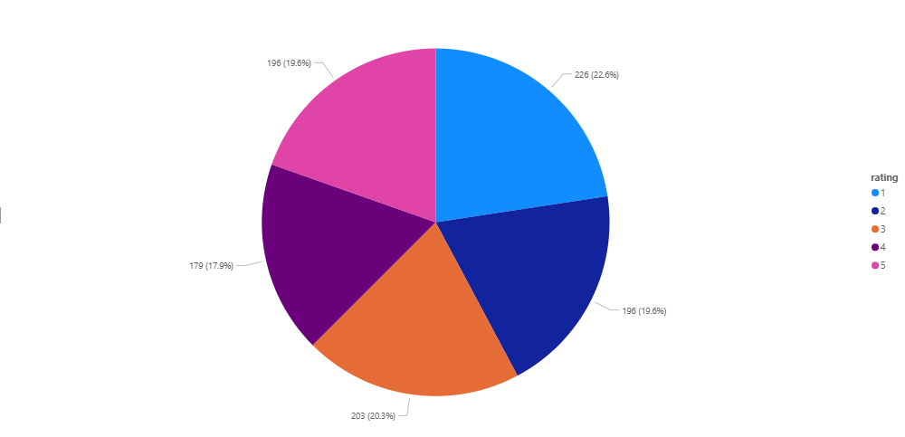
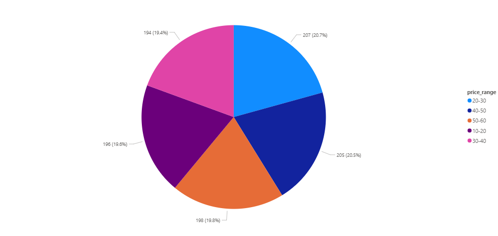

# Books Data Engineering Pipeline

An **end-to-end modern data engineering project** that extracts book data from the web, loads it into a **PostgreSQL data warehouse**, transforms it into **Bronze–Silver–Gold layers** using **dbt**, automates the pipeline with **Apache Airflow (Astro CLI + Docker)**, and visualizes insights interactively in **Power BI**.

---

##  Architecture Overview

---

##  Tech Stack

| Layer | Tool / Library | Purpose |
|-------|----------------|----------|
| **Ingestion** | Python, requests, BeautifulSoup, pandas | Scrape book data from `books.toscrape.com` |
| **Storage** | PostgreSQL (via SQLAlchemy) | Bronze storage for raw data |
| **Transformation** | dbt-core, dbt-postgres | SQL transformation models (Silver + Gold) |
| **Orchestration** | Apache Airflow (Astro CLI) | Automate ETL pipeline with DAGs |
| **Infrastructure** | Docker, .env | Containerized runtime & secrets |
| **Visualization** | Power BI Desktop | Analytics dashboards and insights |

---

##  Project Structure

├── airflow/

│   └── dags/books_pipeline.py

├── dashboard/

│   └── books_report.pbit

├── data/

│   └── bronze/books_toscrape_raw_cleaned.csv

├── dbt/

│   ├── models/

│   │   ├── silver/silver_books.sql

│   │   └── gold/gold_books_by_rating.sql

│   ├── sources.yml

│   └── dbt_project.yml

├── scraping.py

├── requirements.txt

├── .gitignore

├── LICENSE

└── README.md

## Setup Instructions

## Local Environment (Scraper)
--bash
cd end-to-end
python -m venv .venv
.\.venv\Scripts\activate
pip install -r requirements.txt
 -Airflow (Astro CLI + Docker)
bash
Copy code
cd airflow
astro dev init
astro dev start
Then open http://localhost:8080, unpause the DAG, and trigger the pipeline.

 -Environment Variables
Create a file named airflow/.env:

env

PG_HOST=host.docker.internal

PG_PORT=5433

PG_DB=books_scraping

PG_USER=postgres

PG_PASSWORD="your_password"

- dbt Configuration

Path inside the container:

/opt/ee/dbt/books_project/profiles.yml

yaml

Copy code

books_pipeline:

  target: dev
  
  outputs:
  
    dev:
    
      type: postgres
      
      host: "{{ env_var('PG_HOST') }}"
      
      port: "{{ env_var('PG_PORT') | int }}"
      
      user: "{{ env_var('PG_USER') }}"
      
      password: "{{ env_var('PG_PASSWORD') }}"
      
      dbname: "{{ env_var('PG_DB') }}"
      
      schema: "analytics"
      
      threads: 4

Run inside the container:

bash

astro dev bash

cd /opt/ee/dbt/books_project

dbt debug --profiles-dir .

dbt run --select silver_books --profiles-dir .

- Example dbt Model

File: silver_books.sql

sql

Copy code

{{ config(materialized='table') }}

SELECT

    md5(trim(product_url)) AS record_id,
    
    trim(title) AS title,
    
    CAST(regexp_replace(price_raw, '[^0-9\.]', '', 'g') AS numeric(10,2)) AS price,
    
    CASE rating_raw
    
         WHEN 'One' THEN 1
         
         WHEN 'Two' THEN 2
         
         WHEN 'Three' THEN 3
         
         WHEN 'Four' THEN 4
         
         WHEN 'Five' THEN 5 END AS rating,
    
    (availability_raw ILIKE '%In stock%') AS in_stock,
    
    trim(product_url) AS product_url,
    
    now()::timestamptz AS load_ts

FROM {{ source('bronze', 'books_toscrape') }}

- Power BI Visualization

Step 1 — Connect to PostgreSQL

Home → Get Data → Database → PostgreSQL

Server: localhost:5433

Database: books_scraping

Load: analytics_gold.gold_books_by_rating

- Example Dashboard Previews

**Books by Rating**  

**Books by Price Range**  

-License

MIT License © 2025 Selman Bytyqi

- Author
Selman Bytyqi
Data Engineer
